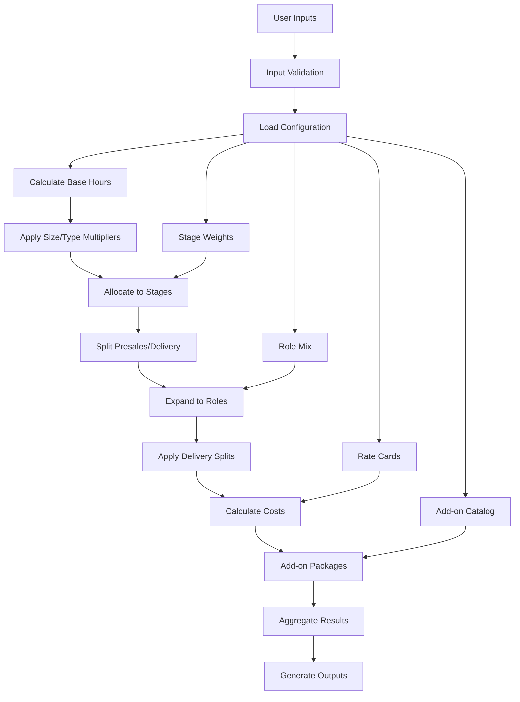

# N2S Delivery Estimator - Architecture

## Overview

The N2S Delivery Estimator is built as a modular Streamlit application with clear separation of concerns across data loading, business logic, and presentation layers.

## Module Responsibilities

### Core Engine (`src/n2s_estimator/engine/`)

`datatypes.py`

- Pydantic data models for all configuration and calculation data
- Input validation and type safety
- Business rule enforcement (percentages sum to 1.0, etc.)

`loader.py`

- Excel workbook parsing and data extraction
- Configuration validation and normalization
- Error handling for missing or malformed data

`estimator.py`

- Core Base N2S estimation logic
- Stage hour allocation and presales/delivery split
- Product role mapping and multiplier application

`pricing.py`

- Role expansion from delivery hours
- Delivery split application (onshore/offshore/partner)
- Rate card lookup and cost calculation

`addons.py`

- Integrations and Reports package calculations
- Tier-based hour allocation and role distribution
- Independent pricing from base package

`orchestrator.py`

- Main coordination of all estimation components
- Results aggregation and summary calculations
- Public API for UI and external consumers

`validators.py`

- Configuration validation rules
- Methodology drift detection
- Warning and error reporting

### User Interface (`src/n2s_estimator/ui/`)

`main.py`

- Streamlit application entry point
- Sidebar parameter controls with validation
- Multi-tab results display
- Scenario save/load functionality
- Chart and visualization generation

### Export (`src/n2s_estimator/export/`)

`excel.py`

- Styled Excel workbook generation
- Multiple worksheet creation with formatting
- Conditional formatting and data bars
- Board-ready presentation formatting

### Data (`src/n2s_estimator/data/`)

`n2s_estimator.xlsx`

- Master configuration workbook
- Stage weights, role mixes, rate cards
- Add-on catalog and product mappings
- Authoritative source for all business rules

## 10-Step Data Flow Diagram



### Detailed Flow

1. **User Inputs**: Product, size, delivery type, locale, add-on selections
2. **Input Validation**: Tier mixes sum to 1.0, reasonable counts, valid selections
3. **Load Configuration**: Parse Excel workbook, validate business rules
4. **Calculate Base Hours**: Start with 6,700 baseline hours
5. **Apply Multipliers**: Size (0.85-1.5x), delivery type (0.9-1.0x), maturity factor
6. **Allocate to Stages**: Distribute hours using stage weight percentages
7. **Split Presales/Delivery**: Use activity flags or stage defaults
8. **Expand to Roles**: Apply per-stage role mix percentages to delivery hours
9. **Apply Delivery Splits**: Onshore/offshore/partner distribution per role
10. **Calculate Costs**: Apply locale-specific rate cards
11. **Add-on Packages**: Independent calculation for Integrations and Reports
12. **Aggregate Results**: Combine base and add-ons, generate summaries
13. **Generate Outputs**: UI display, Excel export, validation warnings

## Spreadsheet Control Points

### Primary Configuration (`n2s_estimator.xlsx`)

Stage Weights Sheet (Configuration)

- Controls: Phase, Stage, Stage Weight %
- Validation: Must sum to 1.0
- Impact: Hour allocation across project lifecycle

Role Mix Sheet (Configuration)

- Controls: Stage, Role, Role Mix %
- Validation: Must sum to 1.0 per stage
- Impact: Resource allocation within each stage

Rates (Locales) Sheet (Configuration)

- Controls: Role, Locale, Onshore/Offshore/Partner rates
- Validation: Must have rates for all enabled roles
- Impact: Cost calculation by geography and delivery model

Delivery Mix Sheet (Configuration)

- Controls: Global and per-role onshore/offshore/partner splits
- Validation: Must sum to 1.0 per row
- Impact: Resource distribution and blended rates

Add-On Catalog Sheet (Configuration)

- Controls: Package, Tier, Unit Hours, Role, Role %
- Validation: Role % must sum to 1.0 per tier
- Impact: Independent add-on package pricing

Product Role Map Sheet (Configuration)

- Controls: Role, Banner Enabled, Colleague Enabled, Multiplier
- Validation: Boolean flags, non-negative multipliers
- Impact: Role availability by product selection

### Derived Calculations

Effective Hours (Calculations)

```plaintext
Adjusted Base = Baseline × Size Multiplier × Delivery Type Multiplier × Maturity Factor
Stage Hours = Adjusted Base × Stage Weight %
Delivery Hours = Stage Hours × (1 - Presales %)
Role Hours = Delivery Hours × Role Mix % × Product Multiplier
```

Cost Calculations (Derived)

```plaintext
Split Hours = Role Hours × Delivery Split %
Split Cost = Split Hours × Rate[Locale][Split]
Total Cost = Sum(Split Costs)
Blended Rate = Total Cost / Total Hours
```

## Key Design Decisions

### Separation of Concerns

- **Data Models**: Pure data structures with validation
- **Business Logic**: Stateless calculation engines
- **Presentation**: UI components with no business logic
- **Configuration**: External Excel workbook for business rules

### Validation Strategy

- **Input Validation**: Pydantic models with business rule enforcement
- **Configuration Validation**: Loader-level checks with warnings
- **Runtime Validation**: Methodology drift detection
- **User Feedback**: Clear error messages and guidance

### Extensibility Points

- **New Locales**: Add rates to Rates (Locales) sheet
- **New Roles**: Add to Role Mix and rate sheets
- **New Add-ons**: Extend Add-On Catalog sheet
- **New Products**: Update Product Role Map sheet

### Performance Considerations

- **Caching**: Configuration loaded once per session
- **Lazy Loading**: UI components render on demand
- **Efficient Calculations**: Vectorized operations where possible
- **Memory Management**: Minimal data retention between calculations

## Error Handling

### Configuration Errors

- Missing sheets: Graceful degradation with defaults
- Invalid percentages: Clear validation messages
- Missing rates: Fallback to US rates with warnings

### Runtime Errors

- Invalid inputs: Pydantic validation with user-friendly messages
- Calculation errors: Detailed error context and recovery suggestions
- Export errors: Fallback options and diagnostic information

### User Experience

- **Progressive Disclosure**: Advanced options in expandable sections
- **Immediate Feedback**: Real-time validation in UI
- **Clear Messaging**: Specific error descriptions and resolution steps
- **Graceful Degradation**: Partial functionality when possible

## Testing Strategy

### Unit Tests

- **Data Models**: Validation rules and edge cases
- **Calculation Engines**: Deterministic math verification
- **Loaders**: Configuration parsing and validation

### Integration Tests

- **End-to-End Scenarios**: Complete estimation workflows
- **Excel Export**: Generated file validation
- **UI Components**: User interaction flows

### Validation Tests

- **Expected Results**: Baseline scenario verification
- **Edge Cases**: Boundary conditions and error states
- **Performance**: Response time and memory usage
